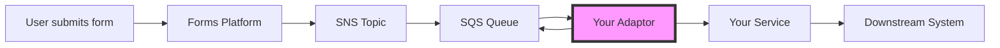
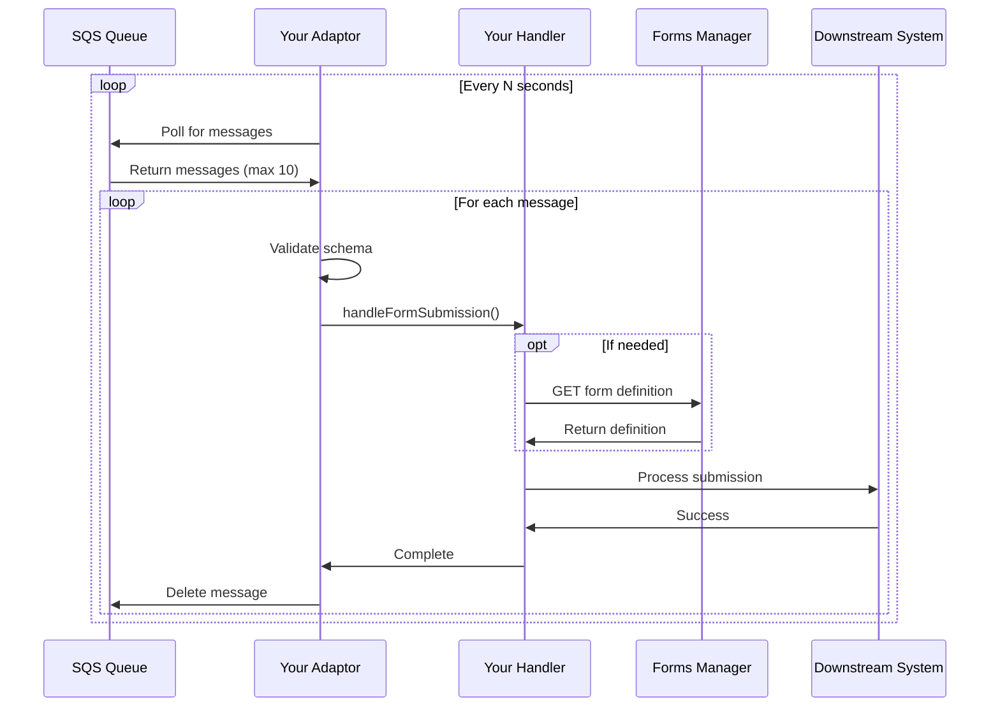
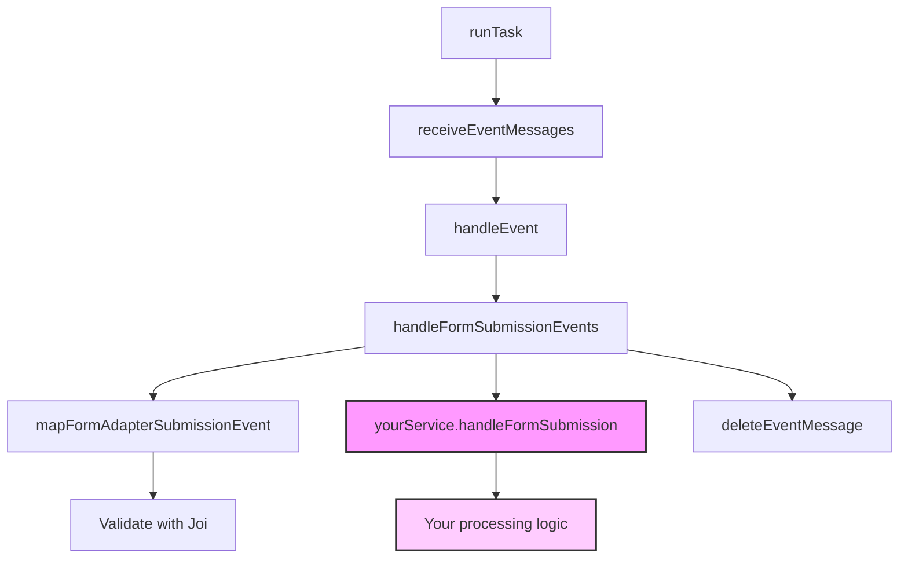
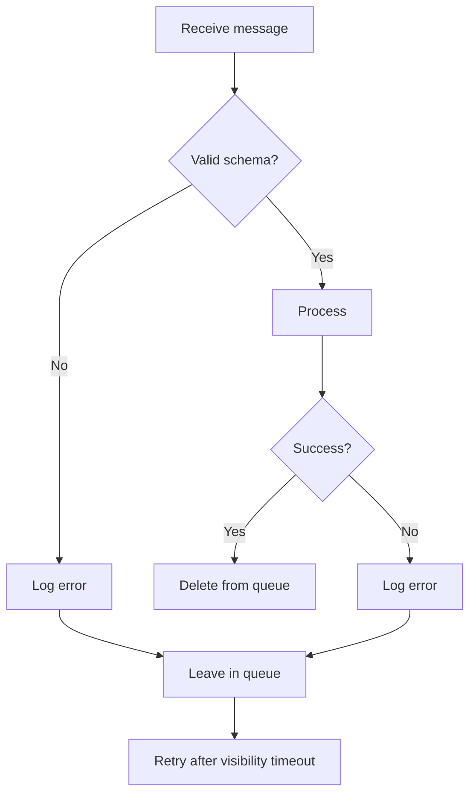

# Architecture

## System overview



Your adaptor sits between the SQS queue and your downstream systems.

## Message flow



## Component architecture



**Your code** plugs into the pink boxes. Everything else is handled by the template.

## Processing guarantees

### At-least-once delivery

Messages may be processed more than once if:
- Your handler takes longer than the visibility timeout
- Your service crashes after processing but before deletion
- AWS SQS delivers duplicates (rare)

**Make your handler idempotent** to handle duplicate processing safely.

### Ordering

Messages are processed in **approximate** FIFO order but this is not guaranteed. If strict ordering is required, consider:
- FIFO SQS queues (different setup)
- Adding sequence handling in your downstream system

### Retry behaviour

Failed messages automatically retry based on your SQS queue configuration:
- Visibility timeout: Message becomes available again after timeout
- Max receives: After N failed attempts, move to DLQ
- Redrive policy: Configure your dead letter queue

## Visibility timeout

When a message is received, it becomes invisible to other consumers for the visibility timeout period. This prevents duplicate processing whilst your handler runs.

Set this to **longer than your handler's expected execution time** (with buffer).

Example config:
```javascript
const visibilityTimeout = 300 // 5 minutes
```

## Scaling considerations

### Single instance
- Processes messages sequentially
- Simple, predictable
- Lower throughput

### Multiple instances
- Each instance polls independently
- Messages distributed across instances
- Higher throughput
- Still at-least-once delivery

### Batch size
Configure `MaxNumberOfMessages` (1-10):
- Higher: Better throughput
- Lower: Faster processing of individual messages

## Health checks

The service exposes a `/health` endpoint for monitoring:
- Returns 200 OK if healthy
- Use for Kubernetes liveness/readiness probes
- Use for load balancer health checks

## Error handling



Failed messages remain in the queue and retry automatically. Configure a dead letter queue to capture messages that fail repeatedly.
